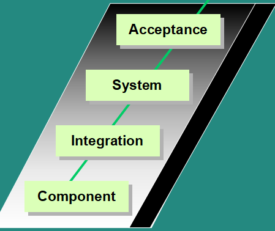
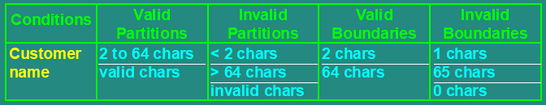
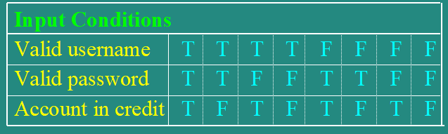
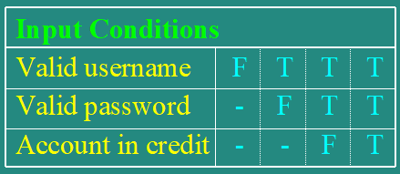
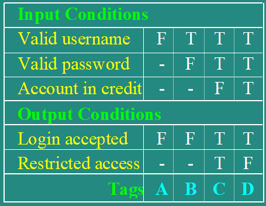
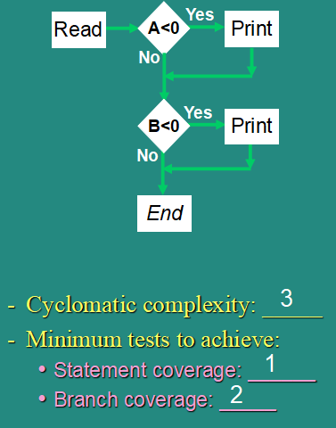

# Test design techniques

## Test development process
* Documentation
* Analysis: test condition
* Design: test case
* Implementation: test procedure (manual) or script (automate)

## Systematic techniques
* Static (non-execution)
    * [Previous chapter](../static/readme.md)
* 
* Functional (blackbox, specification-based)
    * Equivalence partitioning
        * if one value works, all will work
    * Boundary value analysis
        * faults tend to lurk near boundary
    * 
    * Decision table
        * Combine input and output
        * 
        * Rationalise based on outputs not assumptions
        * 
        * Complete and group
        * 
    * State transition diagram/table
    * Cause-effect graphing
    * Why both EP and BVA
        * is the whole partition wrong or just the boundary?
* Structural-based (whitebox)
    * Statement coverage
    * Decision coverage
    * Condition coverage
    * Path coverage
    * 
* Experience-based
    * Error-guessing and fault attacks: just a complement to other techniques
    * Exploratory testing: minimum planning and maximum execution
* Choosing techniques
    * Internal factors
        * Models used
        * Tester knowledge/experience
        * Likely defects
        * Test objective
        * Documentation
        * Life cycle model
    * External factors
        * Risk
        * Customer/contractual requirements
        * Type of system
        * Regulatory requirements
        * Time and budget