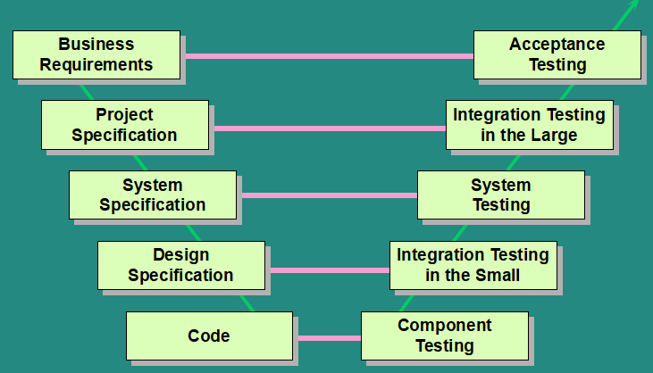
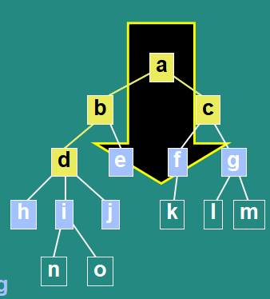
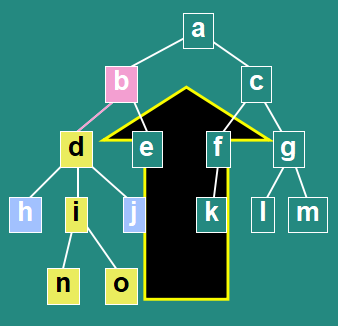
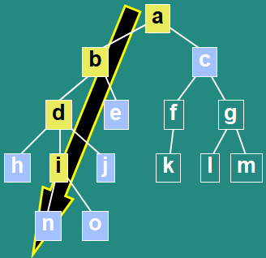
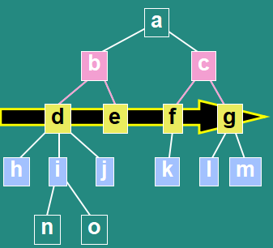
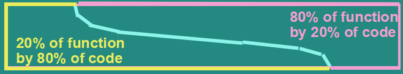

# Testing life cycle

## Software development models
* Sequential
    * Waterfall
    * V-model
* Iterative-Incremental
    * Agile
    * Scrum

## V-model


## Early test design
Helps to build quality, stop faults multiplication

## V and V
* Verification: do the thing right
* Validation: do the right thing

## Economic for testing
* Fixing costs
* Training time on poor requirements
* User make more mistakes
* Morale suffers
* Low productivity

## Test plan
1. Identifier
2. Introduction
3. Test items
4. Features to be tested
5. Features not to be tested
6. Approach
7. Item Pass/Fail Criteria
8. Suspension criteria and resumption criteria
9. Test deliverables
    * Test plan
    * Test design specification
    * Test case specification
    * Test procedure specification
    * Test item transmittal reports
    * Test logs
    * Test incident reports
    * Test summary reports
* Testing tasks
* Environments
* Responsibilities
* Staffing and training needs
* Schedule
* Risk and Contingencies
* Approvals

## Test levels
### Component testing
* Isolated testing usually done by programmer
* aka unit, module, program testing
* Techniques
    * Blackbox testing
        * Equivalence partitioning
        * Boundary value analysis
        * State transition testing
        * Cause-effect testing
    * Whitebox testing
        * Statement testing
        * Branch/decision testing
        * Data flow testing
        * Branch condition testing
        * Branch condition combination testing
        * Modified condition decision testing
        * LCSAJ testing
        * Cyclomatic complexity = # branches + 1
    * Coverage
        * Statement coverage: must be 100%, don't care about branch
        * Branches/decision coverage: 80%, all branch cover
        * Condition coverage: all conditional expression combination
        * Path execution coverage: all combination of all possible branches

### Integration testing in the small
* Test communication between components
* Usually done by designers, analysts, independent testers
* Strategies
    * Big-bang Integration
        * In theory: Combine all at one
        * In practice: Time consuming on locating and fixing faults
    * Incremental Integration
        * Test components one by one
        * Easier fault locating and fixing
        * Version controlling
    * Top-Down Integration
        * 
        * Pros
            * Critical control first
            * Early system demonstration
        * Cons
            * Need stubs
            * Look more complete than it is
    * Bottom-up Integration
        * 
        * Pros
            * Visibility of detail
        * Cons
            * Late system demonstration
            * Need drivers and stubs
            * Major control problems found last
    * Minimum Capability Integration (Functional)
        * 
        * Pros
            * Early control demonstration
            * Visibility of detail
        * Cons
            * Need stubs
    * Thread Integration
        * 
        * Pros
            * Critical processing first
            * Early warning of performance problems
        * Cons
            * Complex drivers and stubs
    * Guidelines
        * Minimise support software needed
        * Each baseline is verifiable
        * Integrate small number of components at once
    * Planning
        * Planned in the architectural design phase

### System testing
* Test functional and non-functional requirements
* Often done by independent testing group
* Functional system testing
    * Based on
        * Functional requirements
        * Functional specification
    * Bussiness process-based testing
        * Bussiness scenarios
        * Use cases
* Non-functional system testing
    * Usability
        * UX/UI
    * Security
        * Authentication and authorization
        * Encryption
        * Permission
        * Levels of access
        * Covert channels
        * Physical security
        * ISMS: information security management system
    * Documentation
    * Storage
    * Configuration/installation
        * Hardware and Software environments
        * Installtion time, uninstallation
    * Reliability/qualities
        * Failures count per amount of time
        * Other qualities: maintainability, portability, adaptability...
    * Back-up/recovery
    * Performance, load, stress
        * Timing test
        * Capacity and volume test
        * Endurance test
    * Multi-user test
        * Concurrency test
        * Multi-user load test
        * Multi-user stress test

### Integration testing in the large
* Test the completed system working with other systems
    * Internet
    * 3rd party packages
    * Internal system (billing, stock)
    * External system (news, suppliers)
* Approach
    * Risk identifying
    * Divide and Conquer
* Planning
    * Resources
    * Co-operation
    * Development plan

### User acceptance testing
* Customer directly test on involve the test
* Benefit: detailed understanding of the new system
* 80/20
    * 
* Contract acceptance testing: against the contract
* Acceptance criteria
    * Defects counts based on severity types
        * Critical: 0
        * Major: 1 - 3 if could be avoided or repaired
        * Minor: 10 - 30
    * Final user sign-off is required
* Alpha and Beta testing:
    * Alpha test at developer site
    * Beta test at user site

```
If you don't have patience to test the system the system will surely test your patience
```

## Test types
* Blackbox testing
    * Functional testing
    * Non-functional testing
* Whitebox testing
    * Structural testing
* Testing related to change
    * Retest
    * Regression test

## Maintance testing
* Change to deloyed software system on its environments
* Triggered by
    * Modification
    * Migration
    * Retirement
* Extensive regression testing required