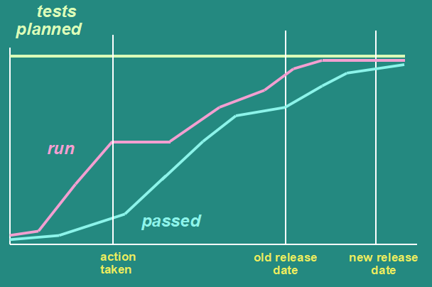
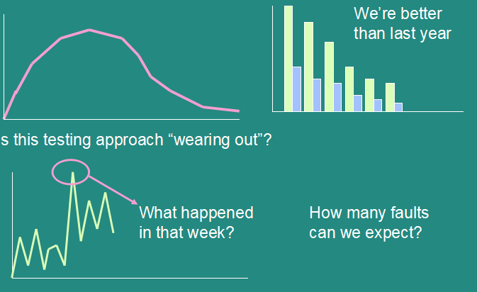

# Test Management

# Organisation
## Structure levels
* Developer
    * Pros
        * Know the code best
        * Found problems that tester will miss
        * Cheap
    * Cons
        * Emotionally
        * Test to see expected results
        * Subjective
* Developement team
    * Pros
        * Some independence
        * Technical depth
        * Friendly with "buddy"
    * Cons
        * Pressure on dev work
        * Technical viewpoint
        * Lack of testing skill
* Tester of team
    * Pros
        * Independent view
        * No dev
        * Same goal with team
    * Cons
        * Lack of respect
        * Lonely, thankless
        * Corruptible
        * Single view
* Dedicated team of testers
    * Pros
        * Independent view
        * Experts
        * Objective
    * Cons
        * "over the wall" syndrome
        * Fighting
        * Over-reliance
* Internal test consultants
    * Pros
        * Experts
        * Better planning, estimation and control form
    * Cons
        * "Lip service"
* Outside Organisation
    * Pros
        * Experts
        * Super independent
    * Cons
        * Lack of product knowledge
        * Expensive

## Usual choices
* Component testing
    * programmer (or buddy)
* Integration testing
    * poorly defined
* System testing
    * independent test team
* Acceptance testing
    * Users (with technical help)

## Skills
* Technique specialists
* Automators
* Database Experts
* Bussiness skills & understanding
* Usability Experts
* Test enviroment Experts
* Test managers

# Configuration Management
Establish and maintain the integrity of the products and ensure all items of testware are identified, version controlled, tracked for changes, related to each other.

# Test estimation, monitoring and control
## Estimation
* Testing is not an independent activity
* Test iteration (cycle)
    * In theory: documenting, blah blah blah
    * In practice: test, debug, retest, debug, ...
* Estimate iteration base on
    * History
    * Expected number of faults
    * Time to report
    * Time waiting for fixes

## Monitor

## Control
Manage actions and decisions

## Risks
Please see [here](../principles/readme.md)

## Product Risks
The possibility that the system or software might fail to satisfy some reasonable customer, user or stakeholder.

## Risk-based testing
Testing help reducing the residual level of product risk

# Incident Management
* Incidents include defects and others (invalid defects (test performed incorrectly, wrong expected results))
* Use of incident metrics
* 
* Report as quickly as possible
* Incident form
    * Test ID
    * Test enviroment
    * Software under test ID
    * Actual & Expected results
    * Severity, Scope, Priority
    * Name of tester
    * blah blah blah