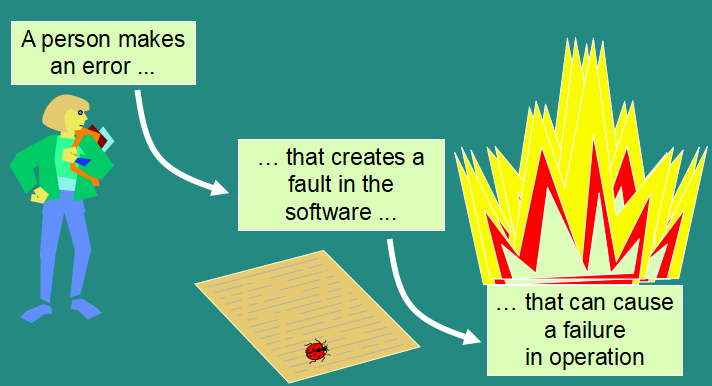
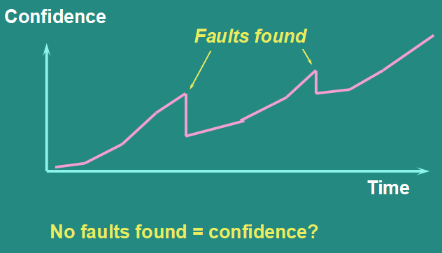
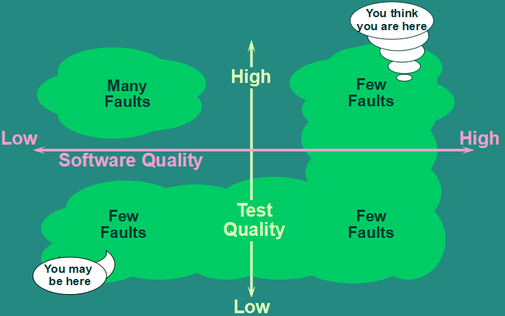

# Principles of Testing

## Necessarity
* Softwares tend to have faults
* Research the reliability of the software
* High paid on failures
* Avoid lawsuit
* Avoid bankrupt

## Concepts
### Error, fault and failure
* Error: human action that produces an incorrect result
* Fault: a manifestation of an error in software (aka bug or defect)
* Failure: a fault be executed
```
    Failure is an event; fault is a state of the software, caused by an error
```


### Bug-free system
There's no bug-free system but a system which have bugs and still be reliable

### The origin of sin
* Human tends to make mistakes (weak knowledge, imperfect)
* Under presure (no time for checking, imcomplete system)
* Predestination

### Test condition
What to be test

### Faults cost
* From inconvenience to billions
* Small mistakes make huge affect (not linearly)

### Safety-critical systems
* Radiation, train, aircraft, ...

### Exhautive Testing
* Test all combination of inputs and outputs
* Impractical amount of time
```
You can't do all tests, just do the best tests in the time available.
```

### Testing criteria
* Base on your confident
* Base on the risks of the system

### Risk
* Is a future event have:
    * Probability
    * Impact
* Facing risk:
    * Mitigation
    * Accept
    * Avoid
    * Insurrance

### Risk-based Testing
* Bad developer's work first

### Aceptance criteria
* Critical defect amount
* Major defect amount
* Minor defect amount: 10-20

### Defect density
    #defect / product size (loc, fp, ucp, usp) <= 2%

### Volume Test
Is performance testing

### Fault cost
    Fault cost = Fixing cost + Lost

### Stubs and Drivers
* Stubs: dummy child code
* Drivers: dummy parent code

## 7 testing Principles
* Testing shows the presence of defects
* Exhautive testing is impossible
* Early testing
* Defect clustering
* Pesticide paradox: developers try to get throuh all tests
* Testing is context dependent
* Absence-of-errors fallacy

## Test process
### Process
* FPT style:
    * Planning
    * Specification
    * Execution
    * Recording
    * Check completion
* Global style:
    * Planning and controlling
    * Analysis and Design
    * Implementation
    * Execution
    * Closure

### Planning
* Test strategy
* Exceptions
* Stubs/drivers, environments
* Test completion criteria

### Specification
* Identify test conditions and prioritise
    * Prioritise: Test the most important but less urgency
* Design test cases
    * Test data
    * Expected result
    * Sets of tests (regression, building confidence, finding faults)
* Implement test (scripts + data)

#### Good test case 
* Effective
* Exemplary
* Evolvable
* Economic

### Execution
* Prioritise
* Partial execution when:
    * Faults fixes
    * Too many faults
    * Time presure
* Automation or manually

### Recording
* Compare expected and actual result
* Repeat process after faults fixing

### Check completion
* Based on criteria specified in test plan
* Repeat activities if not met

#### Test completion criteria
* Defects count
* User requirements

## Psychology
### Why test?
* Build confidence
* Demonstrate conformance to requirements
* Find faults
* Reduce costs
* Show system meet user needs
* Assess the software quality

### Confidence


### Assessing


### Testing approaches
* Traditional
    * Show the system work well
* Better
    * Show the system work badly

### Testing paradox
```
The best way to build confidence is to try to destroy it
```

## Tester
### Rights
* Request accurate information about progress and change
* Insight from developers
* Deliver standard code
* Be regarded
* Find faults
* Challenge specification and test plans
* Become serious
* Make prediction
* Improve yourself

### Responsibilities
* Follow test plans
* Report objectively
* Check report carefully
* Criticize code, not people
* Assess risk
* Prioritise
* Tell the truth

## Independent testing
* Test your own work
    * Assumption
    * Emotionally
    * Hide faults
* Levels
    * Test design by yourself
    * Test design by other
    * Test design by test department or test team
    * Test design by test organization
    * Test generated by tool