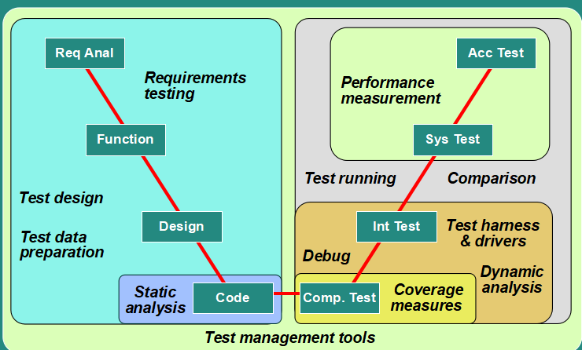

# Tool support for testing

## Types of test tool

* Requirements testing tools
    * Automated support for verification and validation of requirements models
* Static analysis tools
    * Provide quality information
    * Examine code
    * Objective metrics: Cyclomatic complexity, neseting levels, size
* Test design tools
    * Generate test input
* Test data preparation tools
    * Database or files
    * Generate according rules
    * Steal from other
* Test running tools - character-based, GUI
    * Used on automate regression testing with data on repository by programming language via software interface
    * There're two types:
        * Character-based: input and output on terminal
        * GUI: mouse and key events, screen reading
* Comparision tools
    * Included in test running tools for testresult Comparision
    * Standalone tools for comparing databases and files
* Test harnesses and drivers
    * No-gui applications
    * Simulator maybe required
* Performance testing tools
    * Load generation
    * Transaction measurement
* Dynamic analysis tools
    * Provide runtime information
* Debugging tools
    * I never used this
* [Test management tools](manage/readme.md)
* Coverage measurement

## Benefits
* Reduction work
* Consistent
* Objective assessment
* Ease of access

## Risks
* Unrealistic expectation for the tools
* Time, cost and effort on introducing a tool
* Over-reliance
* Interoperability between tools
* Tool vendor problems
* Poor after-sales services
* Defects

# Introduction a tool to the Organization
## 1. State the main principles
* Organization's maturity
* Areas of the Organization helped
* Evaluation tools
* Evaluation vendor
* Plan for implementation
* Return on investment

## 2. Proof of Concept
## 3. Factors of a simple good tool

## Pilot project
* Learn more about the tools
* Fit with existing processes and documentation
* Find the standard ways of using the tools

## Success factors
* Incremental roll-out
* Adapting and improving processes, tools
* Training, coaching and mentoring
* Defining and communicating guidelines